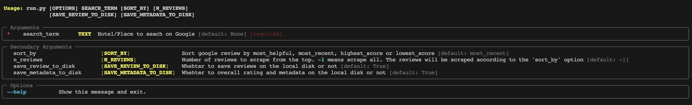

# Google Reviews Scrapper


A Python tool to scrape and collect Google Reviews from various businesses/Travel Places/Hotels. Whether you're a data enthusiast or looking to analyze customer feedback, this tool makes it easy to gather Google Reviews data quickly and efficiently.

## Features

- Retrieve Google Reviews for any business or place
- Sort reviews by most helpful, most recent, highest score, or lowest score
- Specify the number of reviews to scrape
- Specify a stopping criteria (e.g Rather than scraping all the reviews until the end, terminate the scraping process when a specific username or review is encountered. see **config.yml**)
- Save reviews and metadata to your local disk
- Easy-to-use CLI for customization

## Usage 1

Use the command-line interface (CLI) to start scraping Google Reviews. 

```bash
python run.py --help
```



Here are some examples:


```bash
python run.py 'New York Marriott Downtown' 'most_recent'
```
The above command with sort the reviews by 'most_recent' and scrape all the review till the end.

```bash
python run.py 'New York Marriott Downtown' 'most_helpful' 50
```
The above command with sort the reviews by 'most_helpful' and then scrape the top 50 reviews


## Usage 2

Call this from your own code. You can use this method when you want to store the reviews in the database or want to do any other processing on the reviews

```python
from run import run_as_module

# If when you want to use the google page url
run_as_module(
    google_page_url="https://www.google.com/travel/search?....",
)

# When you dont have the url, and want to search the term on google
run_as_module(
    search_term="New York Marriott Downtown"
)
```

## Output
It produces two csv files in the output directory configured in the config.yml "output_dir" field. Below is the example of output path in the config.yml

```yml
output_dir: "<my_output_directory_path>"
```

Below are the two output files and produced fields:

#### metadata.csv
This file contains the overall rating and distribution of rating (eg 5 star, 4 star ...). The produced fields are:


| Field         | Description                                                |
|---------------|------------------------------------------------------------|
| rating        | Overall rating of the business/place/hotel                |
| no_of_reviews | Total number of reviews on Google                         |
| 5-star        | Percentage of 5-star ratings                              |
| 4-star        | Percentage of 4-star ratings                              |
| 3-star        | Percentage of 3-star ratings                              |
| 2-star        | Percentage of 2-star ratings                              |
| 1-star        | Percentage of 1-star ratings                              |
| entity_name   | Name of the business/place/hotel on Google                |


#### reviews_<sort_by>.csv
This file contains review text and related fields. The produced fields are:

| Field             | Description                                                         |
| ----------------- | ------------------------------------------------------------------- |
| full_review       | If user's text is in language other than the english, then this field will contain both original and translated text. And it will be null if user's original text is in english.|
| rating_tags       | Score given to different aspects by the user such as "Rooms 5.0, Service 5.0, Location 5.0" |
| en_lang_text      | English translation of the review by Google, Or the original review text, in case user's language is english |
| other_lang_text   | Original text of the review (In user's own language). It will be null if review is already in english |
| owner_resp_text   | Response text posted by the business owner |
| owner_resp_time   | Date of the business owner's review response |
| username          | Name of reviewer/contributor |
| user_profile      | URL of reviewer/contributor profile |
| date              | Date when the review was posted in humanized format (e.g a day ago, 5 months ago ...) |
| review_post_date             | Date when the review was posted in date/time format "*%m-%d-%Y %H:%M:%S*" (e.g 05-21-2023 15:46:22) |
| review_site       | Site on which the review was posted such as Google, Priceline ... |
| rating_score      | Rating given by the reviewer (e.g 4) |
| total_rating_score| Total rating score (e.g 5) So it will be 4/5 |
| stay_type         | Type of stay (e.g Holiday ❘ Family) |
| review_images     | URLs of review images posted by the reviewer |


## Reviews are opened in two ways
When we google any place and click on the "view reviews" link/button, Reviews can be opened in two modes.
1. They are opened in a new screen. Its like a full screen mode you can easily scroll the reviews. 

2. They are open in a dialog box. And you have to scroll inside that dialog box to scrape the reviews.

There are differences in review text formating in these two modes. For example, In (1) we can see (Original) text and (Translated by Google) text, as part of the displayed review text. Where as in (1) we have to click the "show original" button to see the original review text.


## Config
The structure of the yml files should be the following

```yml
output_dir: "<my_output_directory_path>"

```
- output_dir: The directory where the output file/folders will be created
- stop_criteria: reviewer/contributer to find. Rather than scraping all the reviews until the end, terminate the scraping process when this username/review is encountered.


## Support the Project

If you find this project helpful and would like to support its development, you can Buy Me a Coffee.

<a href="https://www.buymeacoffee.com/hassanbest01" target="_blank"></a>

Your support is greatly appreciated!

## License
This project is licensed under the MIT License - see the LICENSE file for details.

## Contributing
Contributions are welcome! 

## Acknowledgments

Special thanks to [Playwright](https://github.com/microsoft/playwright-python) contributors.

For support and inquiries, please open an issue on the GitHub repository.